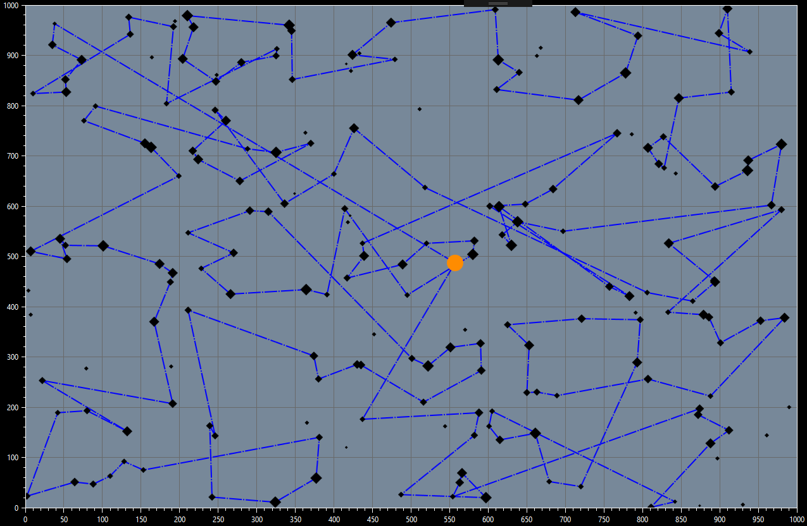
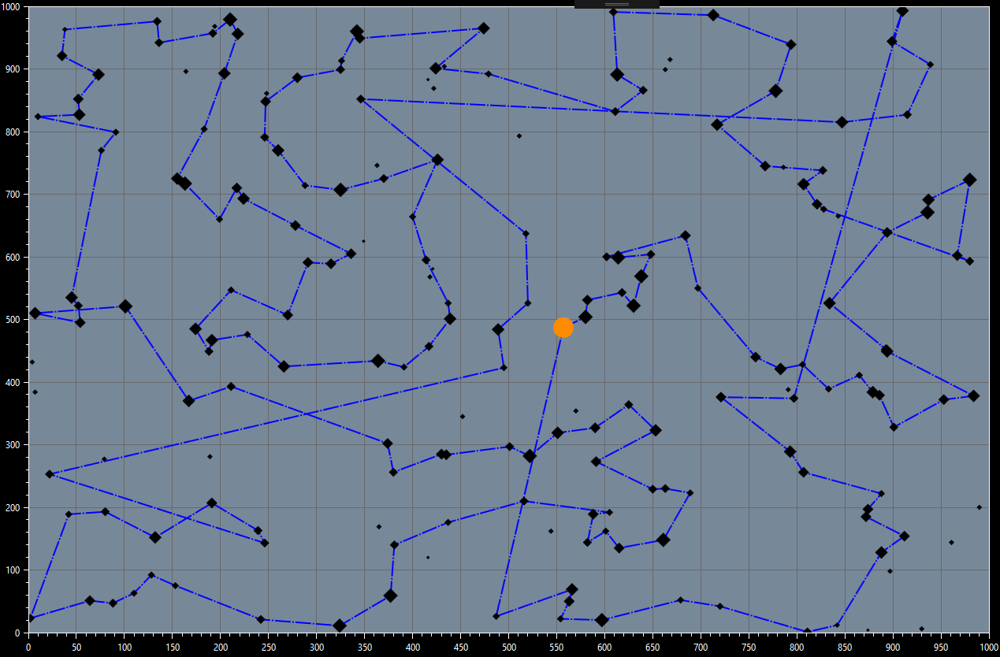
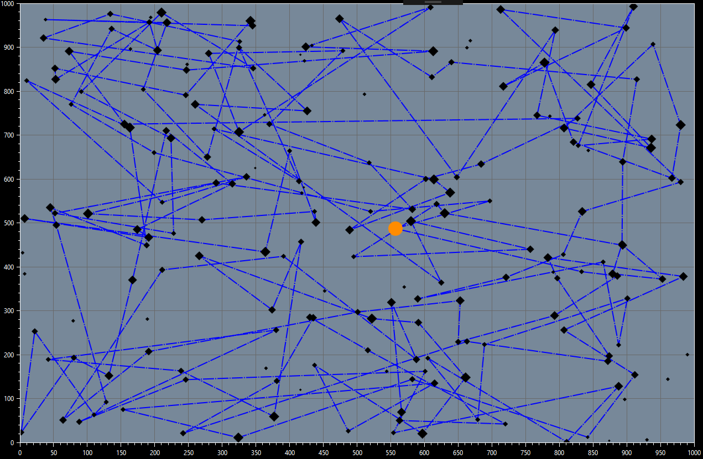
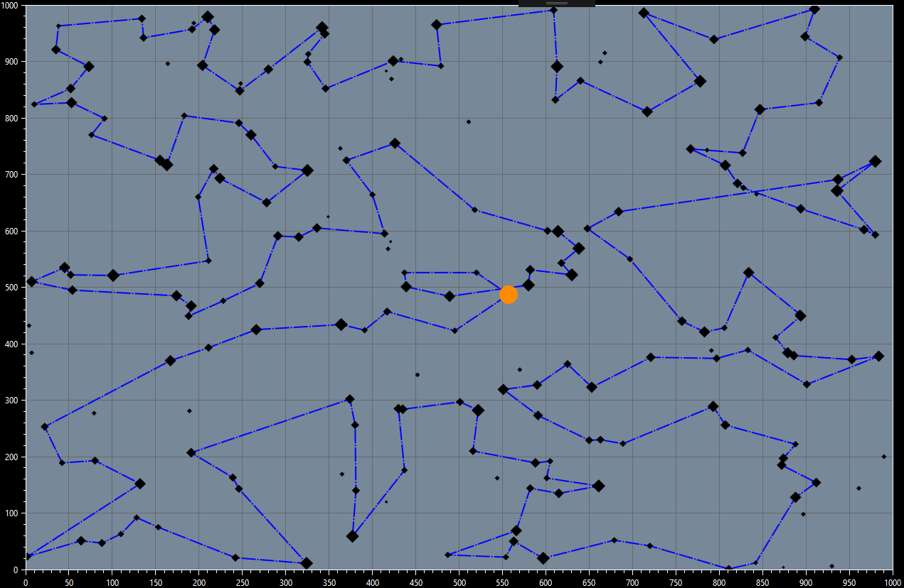

# Eddyfi Challenge Retrospective

The 2018 Eddyfi Challenge took place on October 27th, 2018 at the new HQ of Eddyfi Technologies Inc in Québec City. It was the first edition of the C# programming challenge for CS students.

The contestants, in teams of two, competed to solve a complex problem and find a solution that outperformed the other teams, in only 4 hours of programming. During the competition, a leaderboard was available to rank teams and show the score to beat.

## The challenge

We were provided with a list of 200 jobs that had different bounties and were scattered across a map (1000kmx1000km). Starting from an initial point located close to the center, our program had to select 169 jobs to do and order them to minimize traveling distance. 

Traveling costs are 10$ per unit of distance. We must also take into account the cost of traveling back to our starting position after our last job.

This is a variant of the well-known Traveling Salesman Problem. It's an intensively studied problem for which there is no easy optimal solution. For the competition, we were simply encouraged to get the best score possible in the small time frame available.

## Our solutions

### First iteration : Divide the problem
We began by solving the job selection problem by simply ordering the jobs by their values and selecting the 169 jobs with the highest values. This simplified the problem to finding the best path possible between a fixed number of jobs.

We then tried to divide the problem into smaller problems by forming clusters. The idea was to form clusters of points that were close to each others, then find a path in each cluster by randomly selecting starting and ending points. We could then find a good path to visit the clusters in an efficient order, which is kind of the same algorithm as finding a path inside each clusters.

We took a greedy approach to finding a good path inside each clusters. The algorithm was simply choosing the closest point from the starting point, then selecting the next closest point to current point, until we reached the last point.

When applying that algorithm to clusters, we used a "cluster represent", which is the first point of the cluster's internal path. This way we could find a path that went through all the clusters using our greedy approach.

Result : 579,115.99$

This algorithm gave us a rather disappointing result at 579,115.99$. The path, once drawn in a graph, was clearly sub-optimal and included many long trips.

The problem was the travel distance between the clusters, which ended up being too big to justify the need for our clusters.



### Second iteration : Get on that leaderboard

Seeing that the traveling time between clusters was at fault, we opted for a very simple approach by running our greedy algorithm on all the jobs at once.

Result : 614,665.38$
```diff
+ 35,549.69$
```

Surprisingly, this performed rather well at 614,665.38$ with a path that contained only a few abnormally long paths between points. This algorithm was enough to put us at the top of the leaderboard at this point in the competition.

However, there was a quite noticeable problem, the algorithm didn't take into account the fact that it had to travel back to home at the end. This meant that it finished way too far from the home position.



### Third iteration : Guided looping by mean of clustering

At the third iteration, we wanted to try to take into account the return to home. Knowing the map was always the same and our starting position was also the same, we divided the map in 2 horizontaly and in 4 vertically, which gave us the following divisions : 
```
________________________
|     2     |     3     |
-------------------------
|     1     |     4     |
------------o------------
|     8     |     5     |
-------------------------
|     7     |     6     |
-------------------------
```

So from the starting point located in the middle, we could simply follow the hard-coded clusters in the order shown above. To make sure we finished at the right place at then end of each clusters, we simplified the path finding algorithm in each cluster to simply selecting the closest point in X to go next, which meant that our path was always going from one side to the other, zigzaging in Y all along.

Result : 578,071.99$ ... still no gain.
```diff
- 36,586.39$
```


### Fourth iteration : Smarten it up

At this point in the competition, we are still first on the leaderboard with our simple greedy solution from the second iteration. But we recognized that, if we wanted to have some real gains, we'd need to change our approach entirely.

This time around, we tried abstracting the problem as a problem of links selection. A link is the straight line connecting two points together. We have a finite amount of links possible for our 170 points : 170 * (170 - 1) / 2 = 14 365 links.

So instead of selecting the next point to go until we reach the end, we try to select a combination of links that could optimize the path.

Our intuition was that if we calculated all the links, we could then order them by their distance and simply select the smallest links first, while making sure to avoid selecting more than two links for each points.

So by keeping a count of the number of links selected for each points, we were able to iterate on all the links and select the smallest ones until we had a complete path.

Sadly, we ran out of time to complete our solution before the competition ended. We still won second place with our simple greedy approach, outperformed only by a very small margin. Here is the state we were in at the end of the competition with our link selection algorithm :



We went back home, reopened our computers and continued working on this problem. We felt that we could do better.

Continuing on that fourth iteration, we realized that there was a danger of creating loops during our path building. Indeed, if we have three points that are very close to each other, but farther away from the other points, we are going to create a loop between the three points and our algorithm breaks. This was what was creating the mess illustrated above.

Ok, so we simply need to keep track of segments of links to avoid forming loops? That would work, but there is another issue with our current method.

If there is a point which is really far from the rest of the points, we are going to link it last, because there is a good chance that the links between the other points are smaller. When the time comes to link the far away point, we may link it with the farthest possible point, simply because it was the last point available.

### Fifth iteration : Another attempt at smart

Our next intuition was in line with the smallest links selection. Instead of selecting the smallest link of all, we could select the point that had the biggest smallest link of all.

To explain a little more in depth, we calculate all the links starting from each points and store them in a dictionary by using the point as the key. Then, we take the smallest link for each points, and we select the biggest amongst them. This way, we are linking points which are the farthest from every other points first, because we think they are going to be more costful to link.

This seems good on paper, but it actually fails in many situations. First, we have the same looping problem as iteration four, which adds complexity to simply avoid looping. Second, we end up blocking smaller paths in small clusters. For example, if we have two points which are very close by, but there is two other points which are farther away. If the smallest link for each faraway points is to go to the same point in the small cluster, then we will select those two paths, effectively blocking the point from having another link to its close neighbor.

Still, the method is flawed. We did not even tried to implement it.

### Sixth iteration : Greedy Detours

Ok, at this point, we're starting to think our solutions are too complicated. We need to go back to our first intuition : dividing the problem into smaller problems. What about dynamic programming? 

If we take a small problem, for example linking two points together, then we are sure of being able to find the optimal solution, its two links in between the two points (for the round trip). Then if we add a single point to it, we can still find the optimal solution, it's as simple as splitting one of the link between the first two points to link the third. Still simple.

Now we have three points with the optimal path between them composed of three links. If we add a fourth point to the problem, things get a little more complicated, but not by much.

In fact, we can simply iterate over the existing links and split the one link which is going to make the smallest detour to get to our new point.

Applying this iteratively for our 170 points, we end up building a path that always take into account the fact that it must come back home, and that always tries to minimize its detours. 

Result : 632,443$. That's a significant improvement!
```diff
+ 17,777.62$
```

The beauty of this algorithm is its simplicity : no need to watch out for loops in the path we're creating. Still, our algorithm falls quickly into a local minima, because the order, by which the points appear, changes the links we choose to split. A simple shuffling of the list yields a different result, not too far off from our initial score, but still unpredictable.

We got a score of 637,636$ once just by shuffling for some time!
```diff
+ 5,193$
```



### Seventh iteration : Can we make it predicable?

Instead of simply adding points in the order they come in the initial list, we can try to make the smallest detour of all remaining points. This will ensure that, given the same starting point, the algorithm will always produce the same result no matter the order of the points in the list.

Result : 630,000$.
```diff
- 7,636$
```

This yields a score well below the highest seen score : 630,000$. In this version of the algorithm, we fall in the same local optima pitfall, which prevent us from getting the true best score possible.

## Conclusion

We had a blast solving this problem during the Eddyfi Challenge and we sure learned a lot from it.

Our key take-aways :
* Creating small scale reproduction of the problem to solve manually really helps at understanding the problem. A white board is the most useful tool for reasoning about a problem.
* KISS is still true : "Keep it simple, stupid" is especially relevant when trying to solve a problem. The more constraints and complex rules we add to an algorithm, the more difficult it becomes to reason about the properties of the solution it will find.
* Greedy algorithms are quick and easy ways to find solutions for the Traveling Salesman Problem, but they all have the same pitfall : they will necessarily get stuck in a local optima. Greedy algorithms simplify the problem greatly at the cost of losing the global picture. In problems like TSP, this means that they are only good at finding good-enough solutions, while the true optimal solution is much more difficult to obtain. Sometimes a fast good-enough solution is enough!
* Dynamic programming is really cool and helps a lot to solve problems like this one : it goes hand in hand with the greedy approach. It's not a fit-all solution, but it's a great tool to have in your problem solving tool box.

We wish to thank Eddyfi Technologies for welcoming us in their HQ for this incredible day! If you have any NDT needs, be sure to check them out at https://www.eddyfi.com/ 

Also major props to my partner [@sarahtheflame](https://github.com/sarahtheflame) with whom I share all the credit for these algorithms.
